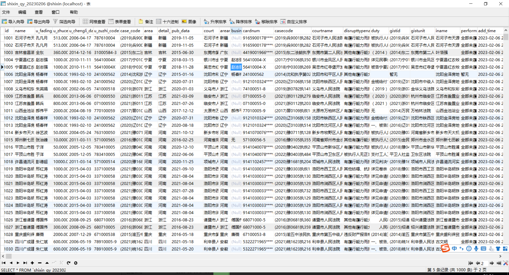
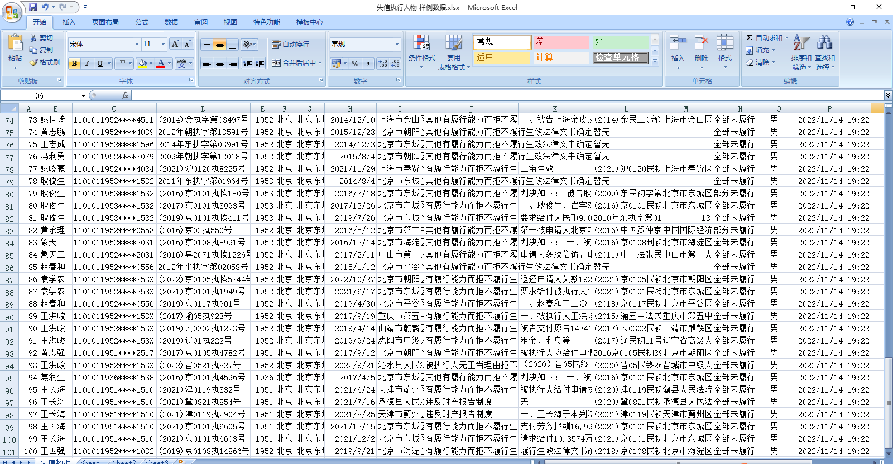

失信被执行人 失信被执行企业 工商数据 数据采集爬虫，获取所有的失信被执行人及企业。 包括曾经历史条文以及现行所有数据。

数据来源 中国执行信息公开网  http://zxgk.court.gov.cn/

执行信息包含 被执行人586W+  被执行企业160W+ 【备注：执行人采集到2022年11月14日，执行企业采集到2022年11月18日】

20230206数据更新
执行信息包含 被执行人6233798条  被执行企业6152217条

另有：裁判文书网数据4000W+版本【更新到2019年】    裁判文书网数据1.3亿版本【更新到2022年】
法律法规290W版本【更新到2021年】     340W版本【更新到2023年】

联系：794564669@qq.com  【承接数据采集、web开发、后端开发等，QQ：794564669 微信：jakejie666】

